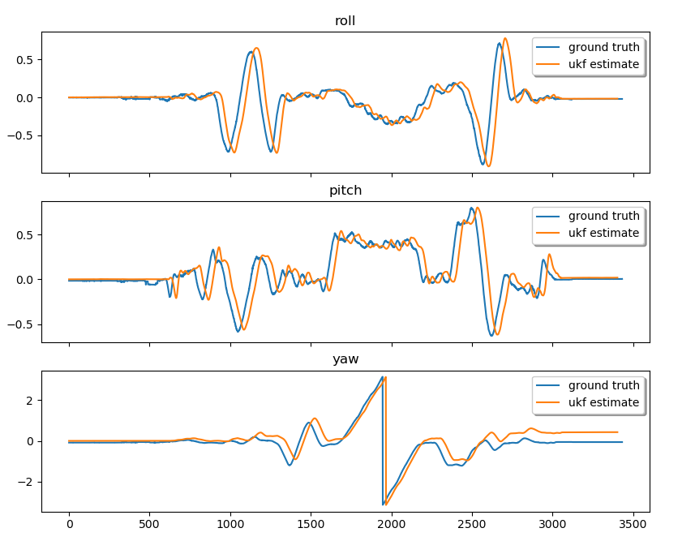
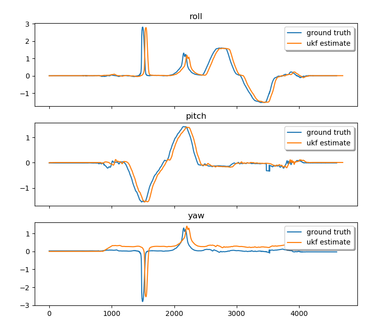

# Unscented Kalman Filter for Attitude Estimation for Quadrotors
Implementation of an Unscented Kalman Filter used for attitute estimation for quadrotors 

## Results
The filtering performance is compared against ground truth provided by the Vicon system
* Trial 1

* Trial 2

